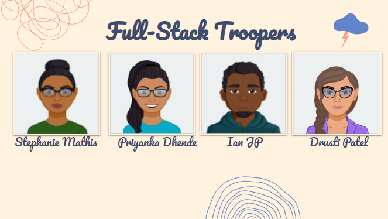
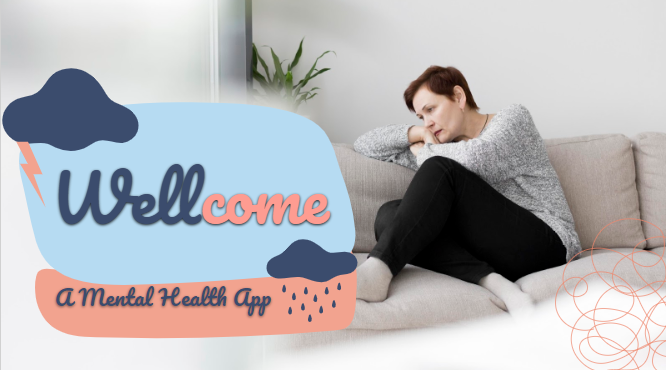
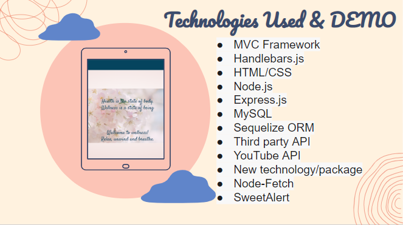
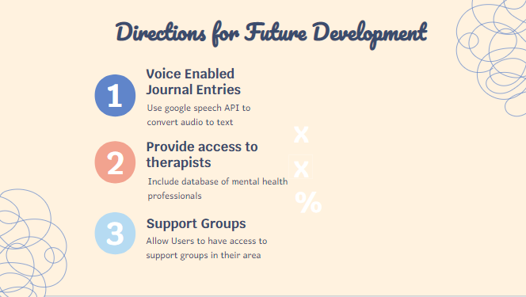
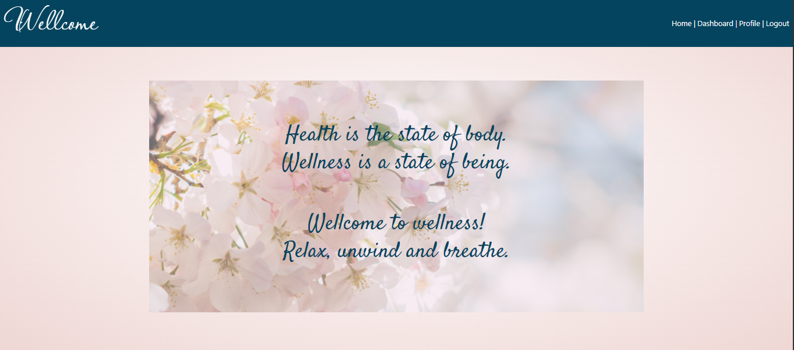
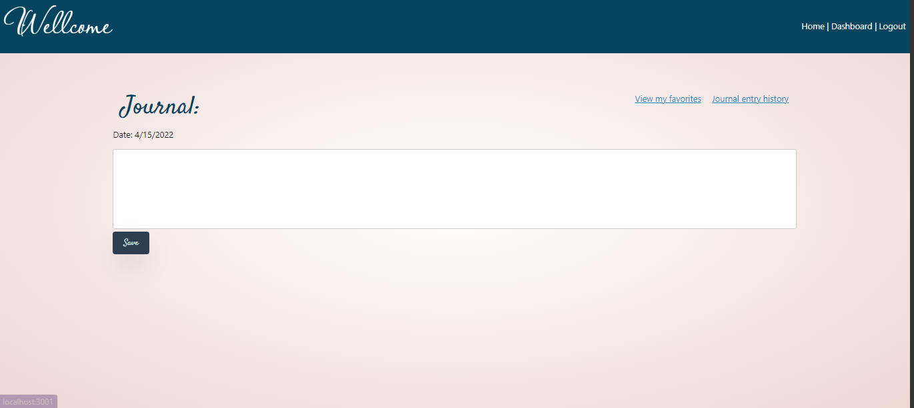
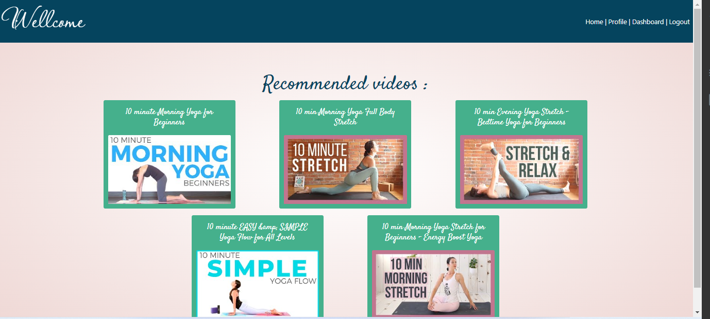
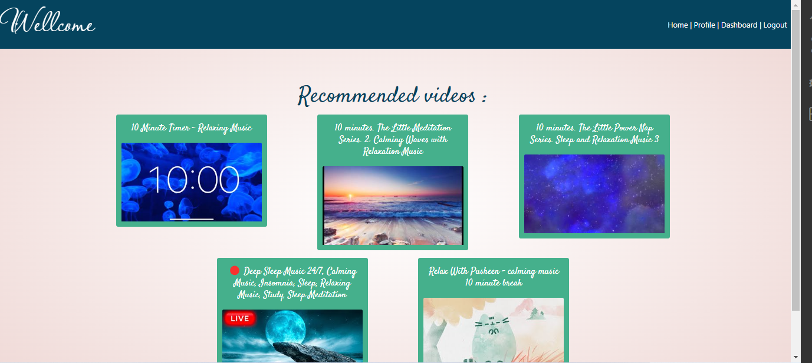

# WellCome - A Mental Health Application (15 Project 2: Interactive Full-Stack Application)

### The Wellcome App is designed to help users who suffer from a wide range of mental health issues, particularly anxiety and depression. The app asks about the user's current mood after the user logs in and displays positive and uplifting affirmations to help them get through the day-to-day with ease. Wellcome has several options for users - they can journal, enjoy a yoga workout, meditate, and listen to relaxing music. 

### URL of Deployed Application: https://wellcome-gtbc.herokuapp.com/

### URL of the GitHub Repository: https://github.com/dpatel615/WellCome

## Meet The Team

## GitHub Contact Information

* Sdm1984 https://github.com/Sdm1984- Stephanie Mathis
* pdhende https://github.com/pdhende- Priyanka Dhende
* HotelYankee https://github.com/HotelYankee- Ian Jean-Pierre
* dpatel615 https://github.com/dpatel615 - Drusti Patel

## User Story & Concept
* As someone who struggles with mental health issues.
* I want an app that can provide therapeutic videos and positive affirmations
* So that I can ease my mind from stressful thoughts and feelings.

## Project Requirements

* Use Node.js and Express.js to create a RESTful API.

* Use Handlebars.js as the template engine.

* Use MySQL and the Sequelize ORM for the database.

* Have both GET and POST routes for retrieving and adding new data.

* Use at least one new library, package, or technology that we haven’t discussed.

* Have a folder structure that meets the MVC paradigm.

* Include authentication (express-session and cookies).

* Protect API keys and sensitive information with environment variables.

* Be deployed using Heroku (with data).

* Have a polished UI.

* Be responsive.

* Be interactive (i.e., accept and respond to user input).

## Presentation Link - https://docs.google.com/presentation/d/1gqlE1YYTyR7t7woyt4Wd4h4MOWAYV0pBFZpORFW_PAE/edit?usp=sharing

## Mock-Up

## Credits

* Avatar Maker
* Mental Health America
* YouTube 
* Slidesgo